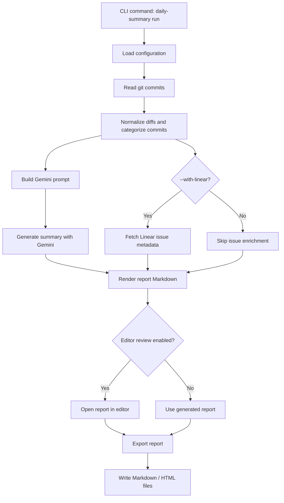
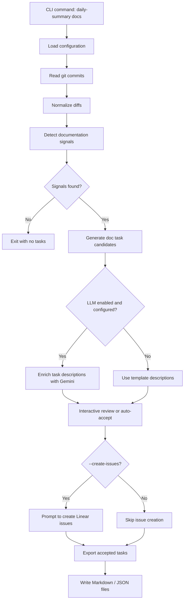
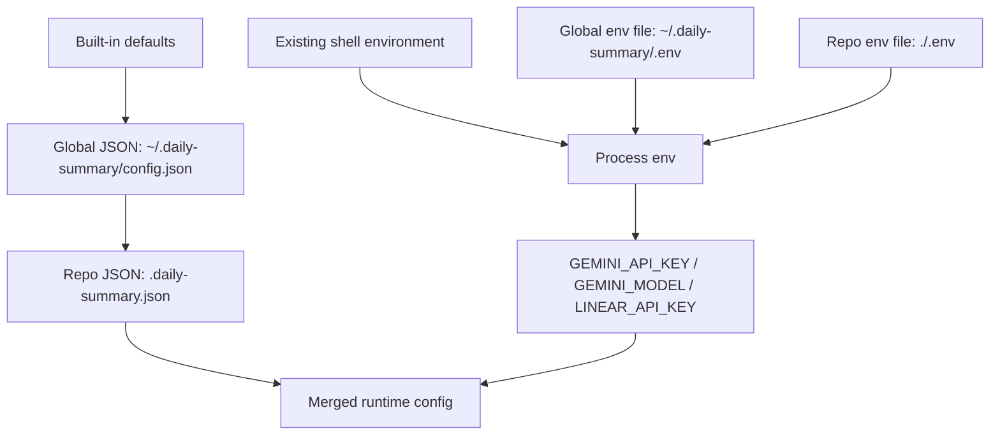

# daily-commit-summarizer

`daily-commit-summarizer` is a TypeScript CLI that turns local Git history into polished daily stand-up summaries. It scans commits for a configurable time window, normalizes noisy diffs, asks Gemini to summarize the work, and exports Markdown or HTML reports. It can also enrich summaries with Linear issue context and detect documentation follow-up tasks from recent code changes.

The project is built for developers who want a low-friction way to answer, "What did I ship recently, and what should I tell the team?"

```markdown
## Summary

**Features**
- Added OAuth2 provider support with PKCE flow

**Bug Fixes**
- Prevented empty query errors in search endpoint

**Chores**
- Upgraded Node.js runtime to v20.10 LTS

## By Issue

### ENG-123: Add OAuth2 provider support _(In Progress / High)_
- `1aa6217` feat: add OAuth2 provider support (+45/-3)
```

## Table of Contents

- [What It Does](#what-it-does)
- [Architecture](#architecture)
- [Directory Structure](#directory-structure)
- [Requirements](#requirements)
- [Local Setup](#local-setup)
- [Environment Variables](#environment-variables)
- [Configuration](#configuration)
- [Commands](#commands)
- [Linear Integration](#linear-integration)
- [Generated Files](#generated-files)
- [Troubleshooting](#troubleshooting)
- [Development Notes](#development-notes)
- [License](#license)

## What It Does

- Scans commits from a local Git repository for a window such as `24h`, `2d`, or `1w`.
- Filters noisy files, binary diffs, lockfiles, build output, and optional repo-specific exclusions.
- Categorizes work into features, fixes, tests, docs, chores, performance, refactors, and other changes.
- Uses Gemini to produce a stand-up-ready summary.
- Exports reports to `~/.daily-summary/reports/` as Markdown, HTML, or both.
- Optionally groups commits by Linear issue when commit messages or branches include identifiers like `ENG-123`.
- Detects documentation-impacting changes and exports reviewable doc tasks.
- Supports local configuration, global configuration, interactive setup, history lookup, and scheduled daily runs.

## Architecture

### Report Generation Flow



### Documentation Task Flow



### Configuration Resolution



The env file loader only fills keys that are not already present in the process environment. In practice, exported shell variables win over env files. JSON config is merged separately, with repo-local `.daily-summary.json` overriding global JSON defaults.

## Directory Structure

```text
.
|-- src/
|   |-- bin/
|   |   `-- daily-summary.ts        # CLI executable entrypoint
|   |-- cli/
|   |   |-- index.ts                # Commander command registration
|   |   |-- review.ts               # Editor-based review helper
|   |   `-- commands/               # run, docs, config, doctor, export, history, schedule
|   |-- config/
|   |   |-- loader.ts               # Defaults, env files, JSON config, masking helpers
|   |   `-- types.ts                # Runtime configuration types
|   |-- docs/
|   |   |-- detector.ts             # Documentation-impact signal rules
|   |   |-- generator.ts            # Doc task generation and optional LLM enrichment
|   |   `-- exporter.ts             # Markdown / JSON doc task export and docs-repo push
|   |-- git/
|   |   |-- ingestion.ts            # Git log/show collection
|   |   `-- normalizer.ts           # Diff cleanup, categorization, budget limiting
|   |-- integrations/
|   |   |-- extractor.ts            # Issue reference extraction from commits/branches
|   |   `-- linear/client.ts        # Linear API wrapper
|   |-- llm/
|   |   |-- gemini.ts               # Gemini provider
|   |   `-- prompts.ts              # Summary prompt construction
|   `-- report/
|       |-- generator.ts            # Report model and Markdown rendering
|       |-- exporter.ts             # Report file writing and lookup
|       `-- html.ts                 # HTML report rendering
|-- .env.example                    # Local env template for source checkout
|-- package.json                    # npm scripts, package metadata, CLI binary mapping
|-- tsconfig.json                   # TypeScript compiler configuration
`-- vitest.config.ts                # Test runner configuration
```

## Requirements

- Node.js 18 or newer
- npm
- Git available in `PATH`
- A Gemini API key from [Google AI Studio](https://aistudio.google.com/apikey)
- Optional: a Linear API key for issue enrichment and doc-task issue creation

## Local Setup

Use this flow when evaluating the project from source.

```bash
git clone https://github.com/vedantnandoskar/daily-commit-summarizer.git
cd daily-commit-summarizer
npm install
cp .env.example .env
```

Edit `.env` and set at least:

```bash
GEMINI_API_KEY=your_gemini_api_key_here
GEMINI_MODEL=gemini-2.0-flash-lite
```

Then verify the setup:

```bash
npm run dev -- doctor
```

Generate a report for this repository:

```bash
npm run dev -- run --repo . --since 24h --no-edit
```

Build and run the compiled CLI:

```bash
npm run build
npm start -- run --repo . --since 24h --no-edit
```

For local CLI-style testing, you can also link the package:

```bash
npm link
daily-summary doctor
daily-summary run --repo . --since 24h --no-edit
```

Reports are written to `~/.daily-summary/reports/` by default.

## Environment Variables

| Variable | Required | Used by | Description |
|---|---:|---|---|
| `GEMINI_API_KEY` | Yes | `run`, `doctor`, `docs` with LLM enrichment | Gemini API key used for summary generation and optional doc-task enrichment. |
| `GEMINI_MODEL` | Yes | `run`, `doctor`, `docs` with LLM enrichment | Gemini model name. The setup wizard defaults to `gemini-2.0-flash-lite`. |
| `LINEAR_API_KEY` | No | `run --with-linear`, `docs --create-issues`, `doctor` | Linear personal API key for fetching issue metadata or creating doc-task issues. |

Environment files:

| File | Purpose |
|---|---|
| `.env.example` | Safe template for local development. Commit this file. |
| `.env` | Repo-local secrets for source checkouts. Do not commit this file. |
| `~/.daily-summary/.env` | Global secrets created by `daily-summary config init`. Useful when running the CLI across many repos. |

## Configuration

The CLI starts with built-in defaults, merges JSON config, then applies supported environment variables.

Default runtime config:

| Field | Default | Description |
|---|---|---|
| `repoPath` | `.` | Repository to scan. |
| `branch` | `main` | Branch passed to `git log`. |
| `timeWindow` | `24h` | Commit window. Supports values like `30m`, `24h`, `2d`, `1w`, or a Git-compatible date string. |
| `llm.summaryLength` | `medium` | Summary length: `short`, `medium`, or `long`. |
| `output.dir` | `~/.daily-summary/reports` | Destination for generated reports. |
| `output.format` | `markdown` via command default | Report format: `markdown`, `html`, or `both`. |

Config files:

| File | Scope | Notes |
|---|---|---|
| `~/.daily-summary/config.json` | Global | Written by `daily-summary config set --global`. Good for non-secret defaults shared across repos. |
| `.daily-summary.json` | Repo-local | Written by `daily-summary config set`. Good for repo-specific defaults. |

Example repo-local `.daily-summary.json`:

```json
{
  "branch": "main",
  "timeWindow": "24h",
  "excludePaths": ["**/package-lock.json", "**/*.snap"],
  "focusAreas": ["src/", "api/"],
  "llm": {
    "summaryLength": "medium"
  },
  "output": {
    "format": "both",
    "dir": "~/.daily-summary/reports"
  },
  "integrations": {
    "linear": {
      "teamId": "team-id-for-doc-task-creation"
    },
    "docsRepo": {
      "path": "/path/to/docs-repo",
      "outputDir": "doc-tasks",
      "autoCommit": false
    }
  }
}
```

Configuration keys:

| Key | Description |
|---|---|
| `branch` | Default branch to scan. |
| `timeWindow` | Default commit window. |
| `repoPath` | Default repo path when `--repo` is omitted. |
| `excludePaths` | Array of patterns or substrings excluded from normalized diffs. |
| `focusAreas` | Array of patterns or substrings; commits outside these areas are skipped. |
| `llm.model` | Model name when set through JSON config. Env `GEMINI_MODEL` also works and is preferred for local setup. |
| `llm.summaryLength` | `short`, `medium`, or `long`. |
| `output.dir` | Report output directory. `~` is expanded when exporting reports. |
| `output.format` | `markdown`, `html`, or `both`. |
| `integrations.linear.teamId` | Linear team ID required for `docs --create-issues`. |
| `integrations.docsRepo.path` | Local docs repository path for `daily-summary docs push`. |
| `integrations.docsRepo.outputDir` | Subdirectory inside the docs repo. Defaults to `doc-tasks`. |
| `integrations.docsRepo.autoCommit` | Whether `docs push` should commit generated doc-task files. |

Secrets should live in `.env`, `~/.daily-summary/.env`, or exported shell variables, not in committed JSON config.

## Commands

### npm Scripts

| Command | Description |
|---|---|
| `npm install` | Install dependencies. |
| `npm run dev -- <command>` | Run the TypeScript CLI directly with `tsx`. |
| `npm run build` | Compile TypeScript and mark the built CLI executable. |
| `npm start -- <command>` | Run the compiled CLI from `dist/`. |
| `npm test` | Run the Vitest test suite. |
| `npm run typecheck` | Run TypeScript without emitting files. |

### CLI Commands

| Command | Description |
|---|---|
| `daily-summary run` | Scan commits and generate a stand-up summary. |
| `daily-summary docs` | Detect documentation tasks from recent commits and review them interactively. |
| `daily-summary docs push` | Push saved doc-task Markdown into a configured local docs repo. |
| `daily-summary doctor` | Validate config and test Gemini/Linear connectivity. |
| `daily-summary config init` | Interactive setup wizard that writes secrets to `~/.daily-summary/.env`. |
| `daily-summary config show` | Print the merged config with API keys masked. |
| `daily-summary config get <key>` | Read a config value by dot path. |
| `daily-summary config set <key> <value>` | Set a repo-local config value. Use `--global` for global config. |
| `daily-summary history` | List saved reports or open a previous report in `$EDITOR`. |
| `daily-summary export` | Re-export or open the latest generated report. |
| `daily-summary schedule` | Create or remove a daily scheduled run. |

### `run` Options

```text
--since <duration>   time window: 24h, 2d, 1w, etc.  (default: 24h)
--branch <name>      git branch to scan               (defaults to config)
--repo <path>        path to the repo to scan         (default: current directory/config)
--length <size>      short | medium | long            (default: medium)
--format <fmt>       markdown | html | both           (default: markdown)
--no-edit            skip editor review, export directly
--with-linear        enrich report with Linear issue data
```

Examples:

```bash
daily-summary run --since 24h --no-edit
daily-summary run --repo ~/Projects/backend-api --since 7d --format both --no-edit
daily-summary run --since 1w --with-linear --no-edit
```

### `docs` Options

```text
--since <duration>   time window                      (default: 24h)
--branch <name>      git branch to analyze
--repo <path>        path to the repo to analyze      (default: current directory/config)
--no-review          auto-accept all detected tasks
--format <fmt>       markdown | json | both           (default: markdown)
--no-llm             use templates instead of LLM
--create-issues      prompt to create a Linear issue per accepted task
```

Examples:

```bash
daily-summary docs --since 7d
daily-summary docs --since 7d --no-review --format both
daily-summary docs --since 7d --create-issues
daily-summary docs push --path ~/docs-repo --auto-commit
```

### `config` Examples

```bash
daily-summary config init
daily-summary config show
daily-summary config get output.dir
daily-summary config set branch main
daily-summary config set output.format both
daily-summary config set integrations.linear.teamId <team-id>
daily-summary config set integrations.docsRepo.path /path/to/docs-repo
daily-summary config set output.dir ~/.daily-summary/reports --global
```

### `history`, `export`, and `schedule`

```bash
daily-summary history
daily-summary history --last
daily-summary history --open 2026-05-18

daily-summary export
daily-summary export --date 2026-05-18 --open

daily-summary schedule --time 08:30
daily-summary schedule --remove
```

On macOS, scheduling writes a LaunchAgent plist under `~/Library/LaunchAgents/`. On Linux and other platforms, the command prints a crontab line to add manually.

## Linear Integration

Linear support is optional.

For report enrichment, `daily-summary run --with-linear` extracts issue identifiers from commit messages and the current branch name, fetches issue metadata, and groups commits under issue headings.

```bash
daily-summary config init
daily-summary doctor
daily-summary run --since 7d --with-linear --no-edit
```

For documentation tasks, `daily-summary docs --create-issues` can create one Linear issue per accepted task. This requires both `LINEAR_API_KEY` and `integrations.linear.teamId`.

```bash
daily-summary config set integrations.linear.teamId <team-id>
daily-summary docs --since 7d --create-issues
```

## Generated Files

| Output | Default location |
|---|---|
| Stand-up reports | `~/.daily-summary/reports/<date>-<repo>.md` and optionally `.html` |
| Documentation tasks | `~/.daily-summary/doc-tasks/<date>-<repo>.md` and optionally `.json` |
| Global secrets | `~/.daily-summary/.env` |
| Global config | `~/.daily-summary/config.json` |
| Schedule logs | `~/.daily-summary/logs/` |

## Troubleshooting

Run `daily-summary doctor` first. It checks required config and tests API connectivity.

| Problem | Fix |
|---|---|
| `GEMINI_API_KEY is not set` | Run `daily-summary config init`, edit `.env`, or export `GEMINI_API_KEY`. |
| `GEMINI_MODEL is not set` | Run `daily-summary config init`, edit `.env`, or export `GEMINI_MODEL=gemini-2.0-flash-lite`. |
| No commits are found | Try `--since 7d`, check `--branch`, or pass `--repo /path/to/repo`. |
| Linear enrichment is skipped | Set `LINEAR_API_KEY` and run with `--with-linear`. |
| `docs --create-issues` cannot create issues | Set `LINEAR_API_KEY` and `integrations.linear.teamId`. |
| Editor review is inconvenient in automation | Use `--no-edit` for reports or `--no-review` for doc tasks. |

## Development Notes

The codebase intentionally keeps the CLI modular:

- command handlers orchestrate flows but delegate work to domain modules;
- Git ingestion and diff normalization are separate from LLM prompting;
- report generation is separated from file export;
- Linear integration is optional and isolated under `src/integrations`;
- documentation-task detection works without an LLM and uses Gemini only for richer task wording when configured.

Before opening a change, run:

```bash
npm run typecheck
npm test
```

## License

MIT
