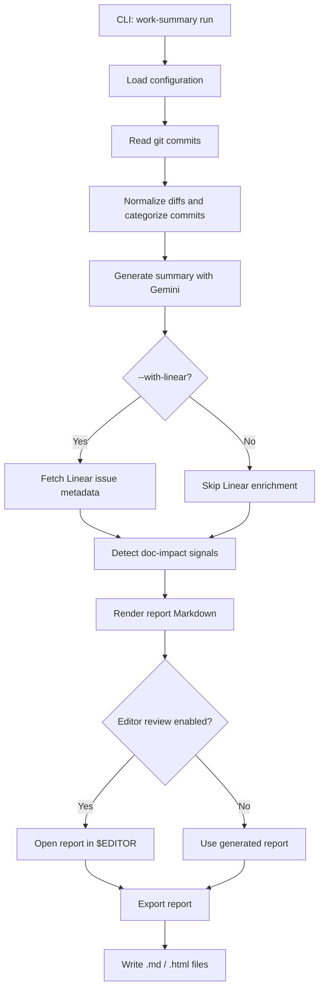
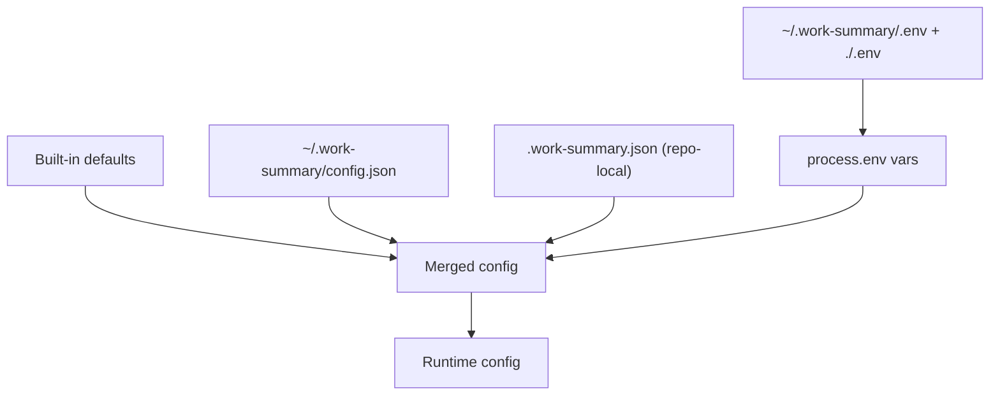

# work-summarizer

[](https://www.npmjs.com/package/work-summarizer)
[](https://www.npmjs.com/package/work-summarizer)
[](LICENSE)
[](https://Vedant1202.github.io/work-summarizer/)

`work-summarizer` is a TypeScript CLI that turns local Git history into polished work summaries. Just oint it at any repo, choose a time window, and get a structured, AI-generated report — categorised by feature, fix, refactor, test, chore, and more.

**[Full documentation →](https://Vedant1202.github.io/work-summarizer/)**

## What It Does

- Scans commits for a configurable window (`24h`, `2d`, `1w`, …) and generates a stand-up-ready summary with Gemini
- Filters noise — lock files, binaries, build output, and configurable excludes
- Enriches reports with Linear issue metadata when commit messages reference tickets
- Detects commits that need documentation follow-up and produces a reviewable task list
- Triggers, polls, and summarises Mintlify documentation deployments
- Exports Markdown and styled HTML reports; supports scheduled daily runs
- Launches a local web UI for reports, run controls, config, and Mintlify management

## Quick Start

```bash
npm install -g work-summarizer
work-summary config init          # set your Gemini API key
work-summary doctor               # verify setup
work-summary run --since 24h --no-edit
work-summary ui                   # open the web UI at http://localhost:7331
```

## Architecture

### Report Generation Flow



### Configuration Resolution



## Requirements

- Node.js >= 18
- Git available in `PATH`
- [Gemini API key](https://aistudio.google.com/apikey) (free tier available)

## Documentation

The full reference — all commands, flags, configuration options, integration guides, and development notes — lives at:

**[https://Vedant1202.github.io/work-summarizer/](https://Vedant1202.github.io/work-summarizer/)**

**[npm package →](https://www.npmjs.com/package/work-summarizer)**

## License

MIT
