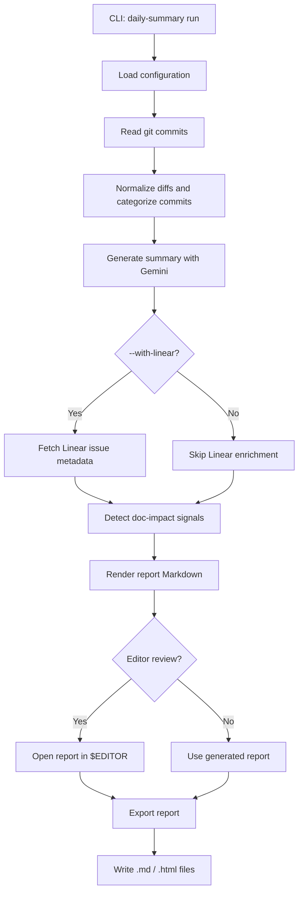
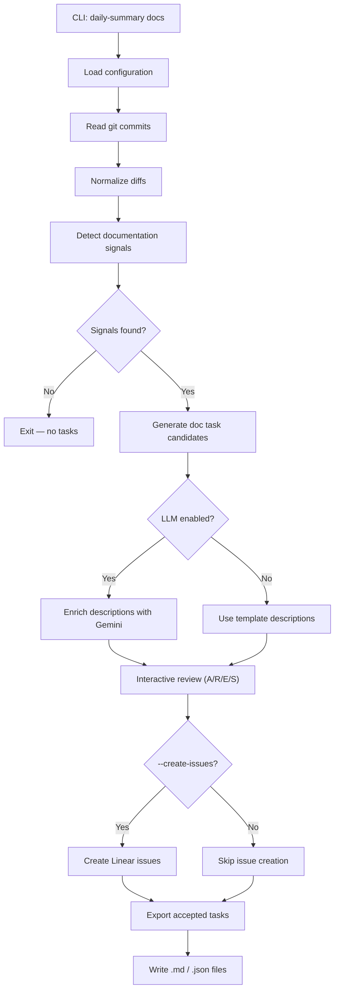
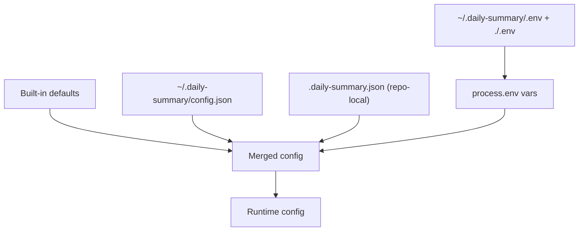
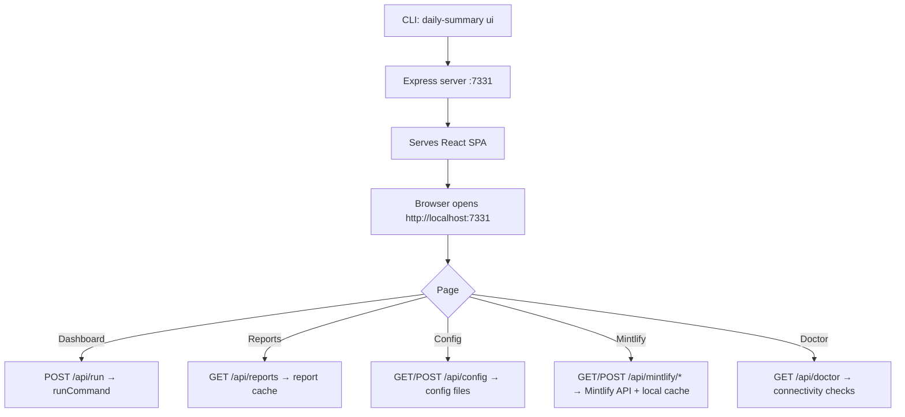

# Introduction

`daily-commit-summarizer` is a TypeScript CLI that turns local Git history into polished daily stand-up summaries. It scans commits for a configurable time window, filters noise, asks Gemini to summarise the work, and exports Markdown or HTML reports — all from a single command.

## What It Does

- **Stand-up summaries** — Scans a git repo for a window like `24h`, `2d`, or `1w` and generates a grouped, readable summary categorised by feature, fix, refactor, test, docs, chore, and performance.
- **Linear enrichment** — Extracts issue identifiers from commit messages and branch names, fetches metadata from Linear, and groups commits under issue headings with status and priority.
- **Doc-task detection** — Analyses diffs for documentation-impacting signals (new exports, CLI flags, breaking changes, schema changes) and produces a reviewable task list with LLM-enriched action items.
- **Mintlify deployments** — Triggers, polls, and tracks Mintlify documentation deployments, with a deployment history cache and an AI-powered changelog summary.
- **Flexible export** — Saves reports as Markdown, styled HTML, or both. Access them later with `history` and `export` commands.
- **Scheduling** — Ships with macOS LaunchAgent and Linux crontab support for automated daily runs.

## Architecture

### Report Generation Flow



### Documentation Task Flow



### Config Resolution Order



Resolution priority (lowest → highest): built-in defaults → global JSON → local JSON → `.env` files → shell-exported environment variables. Shell-exported values override anything written in `.env` files.

### Web UI Flow



## Generated Files

| Output | Default location |
|---|---|
| Stand-up reports | `~/.daily-summary/reports/<date>-<repo>.md` and optionally `.html` |
| Documentation tasks | `~/.daily-summary/doc-tasks/<date>-<repo>.md` and optionally `.json` |
| Global secrets | `~/.daily-summary/.env` |
| Global config | `~/.daily-summary/config.json` |
| Mintlify deploy cache | `~/.daily-summary/mintlify-deployments.json` |
| Schedule logs | `~/.daily-summary/logs/` |

## Source Layout

```
src/
├── bin/daily-summary.ts       CLI entry point
├── cli/
│   ├── index.ts               Commander command registration
│   ├── review.ts              Editor-based review helper
│   └── commands/              run, ui, docs, mintlify, config, doctor, export, history, schedule
├── config/
│   ├── loader.ts              Defaults, env files, JSON config, masking
│   └── types.ts               Runtime configuration types
├── docs/
│   ├── detector.ts            Documentation-impact signal rules
│   ├── generator.ts           Doc task generation + optional LLM enrichment
│   └── exporter.ts            Markdown/JSON export and docs-repo push
├── git/
│   ├── ingestion.ts           git log/show collection
│   └── normalizer.ts          Diff cleanup, categorisation, budget limiting
├── integrations/
│   ├── extractor.ts           Issue reference extraction
│   ├── linear/client.ts       Linear API wrapper
│   └── mintlify/              Deploy client, types, deployment cache
├── llm/
│   ├── gemini.ts              Gemini provider
│   └── prompts.ts             Prompt construction
├── report/
│   ├── generator.ts           Report model + Markdown rendering
│   ├── exporter.ts            Report file writing and lookup
│   └── html.ts                HTML report rendering
└── ui/
    ├── server.ts              Express app factory
    └── routes/                API routes: run, reports, config, mintlify, doctor
ui/                            React + Vite frontend (served by the Express server)
```

## Next Steps

- [Installation →](./installation.md)
- [Run your first summary →](./commands/run.md)
